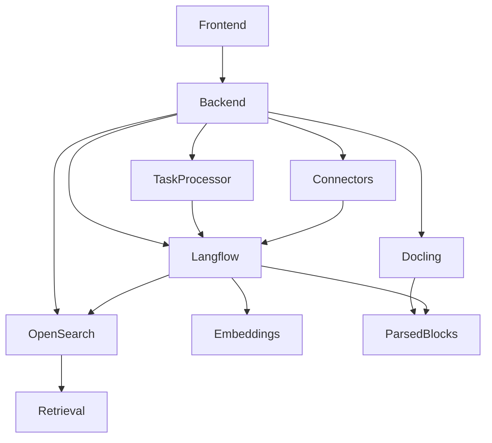

# Knowledge Map OpenRAG

## 1. Что это

Карта знаний системы OpenRAG: основные сущности (компоненты, сервисы, потоки данных) и связи между ними. Предназначена для загрузки в NotebookLM и построения графа знаний для анализа архитектуры, проектирования пайплайнов и модулей и диагностики ошибок.

## 2. Зачем используется

- Анализ архитектуры системы.
- Проектирование новых ingestion и RAG pipeline.
- Проектирование новых модулей и коннекторов.
- Анализ ошибок и ускорение разработки.

## 3. Как работает

### Основные сущности

- **Frontend**: Next.js приложение; UI (Chat, Knowledge, Settings, Connectors), вызовы API к Backend.
- **Backend**: FastAPI; роуты (upload, search, tasks, settings, chat, connectors, documents, auth, provider_health, docling); внедрение сервисов через Depends.
- **Langflow**: сервис потоков; Ingestion Flow, Chat Flow, URL Ingestion Flow; Files API v2; глобальные переменные из окружения.
- **Docling**: сервис парсинга документов; API /v1/convert/file; возврат document.json_content.
- **OpenSearch**: индекс documents; маппинг (text, filename, mimetype, page, chunk_embedding_*, embedding_model, owner, metadata и др.); kNN поиск.
- **TaskService**: хранилище задач (task_id → UploadTask); создание задач (create_langflow_upload_task, create_custom_task); фоновый воркер с семафором; таймаут и очистка.
- **LangflowFileService**: загрузка файла в Langflow, run_ingestion_flow, upload_and_ingest_file, delete_user_file после инжеста.
- **SearchService**: поиск по запросу (эмбеддинг, kNN, фильтры), возврат чанков.
- **ChatService**: вызов Langflow chat flow, история сообщений.
- **Processors**: LangflowFileProcessor (файлы → Langflow), DocumentFileProcessor (традиционный путь), LangflowConnectorFileProcessor (коннекторы), LangflowUrlProcessor (URL).
- **ConnectorService / LangflowConnectorService**: OAuth, список файлов, sync, process_connector_document → Langflow ingestion.
- **SessionManager**: получение opensearch_client по user_id/JWT; создание пользовательского OpenSearch-клиента для multi-tenancy.

### Связи между компонентами

- Frontend → Backend (все API).
- Backend → Langflow (upload, run flow, chat).
- Backend → Docling (health; вызов конвертации при альтернативном пайплайне).
- Backend → OpenSearch (создание индекса, поиск, удаление по filename, проверка дубликатов).
- Langflow Ingestion Flow → Docling (парсинг); → OpenSearch (запись чанков).
- Langflow Chat Flow → OpenSearch (retrieval); → LLM (ответ).
- TaskService → Processors → LangflowFileService / DocumentService.
- ConnectorService → LangflowConnectorService → Langflow (ingestion).
- SearchService → OpenSearch (kNN + фильтры).
- SessionManager → OpenSearch (клиент с JWT для фильтрации по owner).

## 4. Где используется в системе

Карта охватывает все описанные в документации 00–18 компоненты и их взаимодействие.

## 5. Связанные компоненты

Все перечисленные выше сущности и связи.

---

## Component Graph (Mermaid)

См. также файл `diagrams/component_graph.mmd`.

---

## Ключевые понятия

Knowledge map, component graph, ingestion flow, chat flow, retrieval, connector, task queue.

## Основные сущности

Frontend, Backend, Langflow, Docling, OpenSearch, TaskService, LangflowFileService, SearchService, ChatService, Processors, ConnectorService, SessionManager.

## Связанные компоненты

Полный граф компонентов описан в разделах 3 выше и в диаграммах в папке diagrams/.
